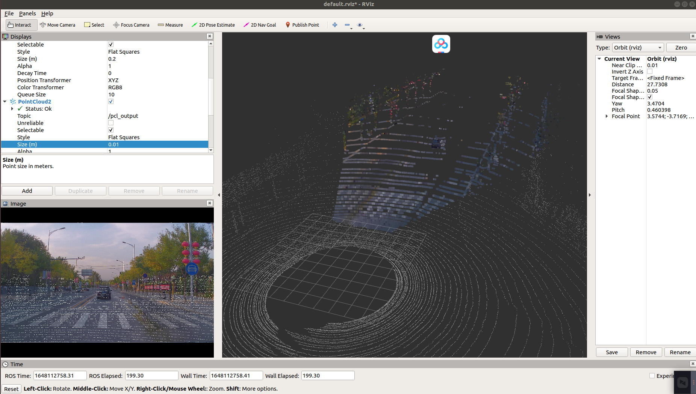

# autoware-project-code
Here you can find the code of projects during learning AutoWare.

## Project 1
Projecting the point cloud to the front image and then create the colorful point cloud, through which we could construct a colorful 3D Map.  

## Project 3
Vehicle detection and segmentation based on Euculidean Cluster.    
**The compelete code will be released after 4.20.**   
    